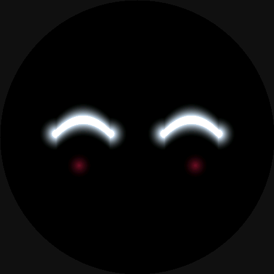
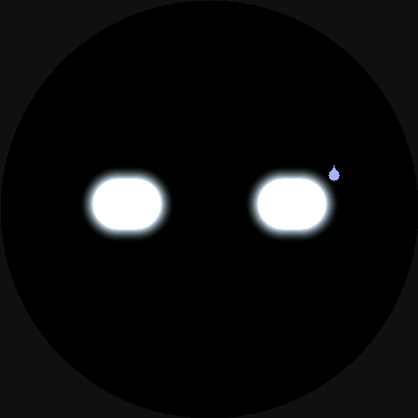
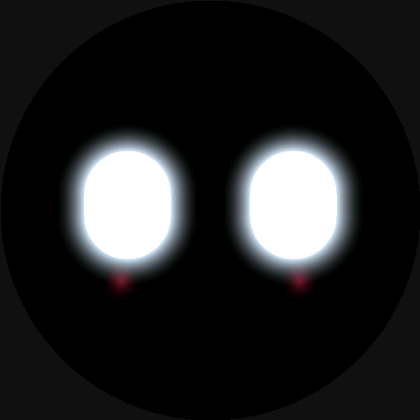

# 模拟太 · Monita

> 名字取自《逆转裁判》希月心音胸前那台 **モニ太（模拟太）**——一块会随主人情绪变色、
> 偶尔还替她把心里话说出来的小电脑。这只是它的现实版。日常我们也叫它「小圆脸」。

挂在 5G CPE 上的一块表情屏，按真实网络状态改变表情。

ESP32-S3 AMOLED 圆屏，一张没有嘴、只靠两只发光眼睛的脸。通过 WiFi 读取路由器的蜂窝网络
指标——信号、吞吐、在线状态——映射成对应表情。状态变化走表情，精确数值翻页查。

## 表情

> 下面不是截图——是用固件**同一套 SDF 渲染代码**在主机上跑出来的（`tools/render_preview.c`），即设备实际画面。

<table>
<tr>
<td align="center"><br><sub>happy 平静</sub></td>
<td align="center"><br><sub>grin 美滋滋</sub></td>
<td align="center"><br><sub>busy 忙 / 烫</sub></td>
<td align="center"><br><sub>surprised 新设备</sub></td>
</tr>
<tr>
<td align="center"><br><sub>offline 断网</sub></td>
<td align="center"><br><sub>sleepy 打盹</sub></td>
<td align="center"><br><sub>wilt 蔫</sub></td>
<td align="center"><br><sub>摸头 弯眼 + 脸红</sub></td>
</tr>
</table>

- 浏览器预览原型：直接打开 [`index.html`](index.html)。
- 设备版：`fw/` 下的 ESP-IDF 固件，跑在真 AMOLED 上。

## 硬件

| | |
|---|---|
| 主控屏 | Waveshare **ESP32-S3-Touch-AMOLED-1.75**（CO5300 466×466 圆形 AMOLED，QSPI；8MB PSRAM / 32MB Flash） |
| 数据源 | OpenWRT 路由 / NRadio CPE（5G 模组），LAN 内提供 `face.json` |

## 工作原理

```
CPE: ubus(infocd cpestatus) ──每3s──▶ /www/face.json  (uhttpd :80)
                                            │  HTTP GET（每 4s）
ESP32-S3 ── WiFi ──────────────────────────┘
   └─ 解析 JSON → 情绪两轴映射(+事件/久闲) → 渲染脸
```

- **情绪两轴**：信号质量（RSRP/SINR）决定「舒不舒服」的底噪心情；吞吐（dl/ul）决定「忙不忙」。
  带**迟滞 + 防抖**不在阈值附近乱跳；**载波聚合/制式切换/上下线**会冒几秒短气泡；久闲自动打盹。
- **七种眼神**：`happy / grin / busy / surprised / offline / sleepy / wilt(蔫)`，眼形 + 腮红/汗/泪 + 中文台词气泡。
- **摸摸头**：长按/蹭屏 → 弯眼笑 + 脸红 + 朝手指蹭 + 冒星露谷风像素爱心；松手回网络态。
- **翻页**：轻点循环 **脸 → 数值页 → 电子吧唧 → 脸**。轻点翻页、长按摸头，两套手势分开。
  - 数值页：RSRP/SINR/载波/吞吐/温度/电量 + 版本号 + **RSRP 趋势折线图**（手搓，不引 LVGL）。
  - 电子吧唧：自定义 **图片 / GIF / 视频**（`tools/mkbadge.py` 烤成 `.m8g`，设备零解码逐帧播、放大铺满、缓存秒开）。
- **重力玩法**（板载 QMI8658 IMU）：歪一歪眼神朝低处偏；摇一摇 → 冒「哇！」；打盹时拿起来就醒。
- **渲染**：纯手写，无 LVGL。圆角盒 / 抛物线弧 / 折线 SDF 画眼睛，分层加性合成上光晕与配件，
  中文气泡用离线烤的 GB2312 点阵字库（见 `tools/genfont.py`）。

## 目录

固件按职责拆成小模块，`monita_main.c` 只剩编排 + 渲染主循环：

```
index.html              浏览器预览（设计原型）
fw/main/
  monita_main.c         app_main + 渲染主循环（动画状态机 / 翻页手势）
  display.c/.h          面板(CO5300 QSPI) + 分块推屏 + SDF 画眼 + 字库 + 气泡/电量/数值页/图片
  mood.c/.h             情绪两轴映射 + 事件状态机 + 动态气泡（mood_update）
  net.c/.h              WiFi + 轮询 face.json + 文件下载（吧唧）
  ota.c/.h              手动 esp_ota 流式自更新
  touch.c/.h            CST9217 触摸驱动 + 轮询任务
  imu.c/.h              QMI8658 IMU（重力倾斜 / 摇一摇 / 拿起唤醒）
  power.c/.h            AXP2101 电量
  i2c_bus.c/.h          共享 I2C 总线（电量 / 触摸 / IMU）
  version.h             FW_VERSION（OTA 比对，发版改一处）
  font_cjk.h            生成的 GB2312 24×24 点阵字库
  sdkconfig.defaults    板级配置（32MB Flash + Octal PSRAM + -O2）
  partitions.csv        OTA 双槽 + 存储分区
tools/genfont.py        字库烤制脚本（macOS + PIL）
tools/mkbadge.py        电子吧唧：图片/GIF/视频 → .m8g（macOS + PIL）
tools/render_preview.c  用固件 SDF 渲染逻辑把表情渲成 PNG（README 配图）
```

## 构建 / 烧录

需要 [ESP-IDF v5.4](https://docs.espressif.com/projects/esp-idf/)（target `esp32s3`）。

```bash
cd fw
cp main/wifi_secret.h.example main/wifi_secret.h   # 填入你的 WiFi
# 改 main/net.c 里的 FACE_URL 指向你的数据源
idf.py set-target esp32s3
idf.py -p <PORT> flash monitor
```

> 数据出口：在 CPE 上放一个定时把蜂窝指标写成 JSON 的脚本（`/www/face.json`，字段见
> `map_mood()`），ESP32 直接 `GET http://<网关>/face.json` 即可。

## 电子吧唧（自定义 图片 / GIF / 视频）

设备端**零解码**——在 Mac 上把任意图烤成 `.m8g`（多帧 RGB565），板子直接逐帧播、放大铺满、进页缓存：

```bash
# 图片 / GIF（静态=1帧，GIF=多帧）
python3 tools/mkbadge.py 你的.gif badge.m8g

# 视频：ffmpeg 先缩后裁中心方块 → GIF → mkbadge
ffmpeg -i 视频.mp4 -vf "scale=-2:200,crop=200:200,fps=10,split[a][b];[a]palettegen[p];[b][p]paletteuse" -y /tmp/clip.gif
python3 tools/mkbadge.py /tmp/clip.gif badge.m8g 200

cat badge.m8g | ssh root@<网关> 'cat >/www/badge.m8g'   # 脚本会打印这行
```

翻到吧唧页即播；停留 45s 自动回脸（AMOLED 防烧屏，脸才是常驻态）。换图重跑覆盖、重启板子刷新缓存。

## OTA 自更新（改完代码免插线）

```bash
# 改 version.h 里的 FW_VERSION +1，build
idf.py build
cat build/monita-fw.bin | ssh root@<网关> 'cat >/www/monita-fw.bin'
echo -n <新版本号>       | ssh root@<网关> 'cat >/www/monita.ver'
# 板子 15s 内自动发现 → 拉取 → 写备用槽 → 重启
```

## 重新烤字库（可选）

`font_cjk.h` 已随仓库提供。要改字号/字符集，在 macOS 上：

```bash
python3 tools/genfont.py     # 需要 Pillow + 系统中文字体
```

## 进度

- [x] 浏览器原型（六态 + 待机动画）
- [x] 点屏（CO5300 QSPI 驱动）
- [x] 没有嘴的脸 + 眨眼 / 呼吸 / 瞟眼
- [x] 六种表情 + 腮红 / 汗 / 泪 + 中文气泡
- [x] WiFi 连网 + 轮询 `face.json` + 数据驱动表情
- [x] OTA 自更新（WiFi 拉固件，build → 拷 bin 到路由器 → 板子自升，告别 USB）
- [x] 电量读取（板载 AXP2101，I2C）— 显示挪到摸头时呈现
- [x] 摸摸头（CST9217 触摸：被摸→弯眼笑+脸红+朝手指蹭+台词气泡+亮电量，松手回网络态）
- [x] 情绪逻辑 v2（信号/吞吐两轴 + 迟滞防抖不乱跳；载波/制式/上线事件冒短气泡；久闲打盹）
- [x] 翻页 + 数值页（精确指标含版本号 + RSRP 趋势折线图；轻点翻页 / 长按摸头）
- [x] 电子吧唧（图片 / GIF / 视频 → `.m8g` 逐帧播，零解码、放大铺满、缓存秒开）
- [x] IMU（QMI8658：重力倾斜眼神 / 摇一摇 / 拿起唤醒）
- [x] 摸头像素爱心（星露谷风）
- [x] 省电 D1（按需渲染 + WiFi modem-sleep + 调亮度）
- [ ] 深睡省电（light-sleep 与 WiFi 冲突，暂搁置）
- [ ] 上盒子（固定在 CPE 上常驻）

## 美术

> 以下纯属玩梗，工程内容到上面为止 😌

**我是一个模拟太！**
对你是！台下 3k9x 欣喜若狂
**我有两个眼睛！！**
天呐下面 9x 狂欢呐
哦你好勇敢你讲出你是一个模拟太
